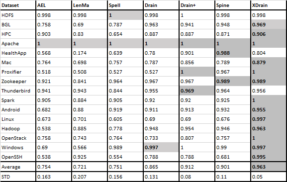
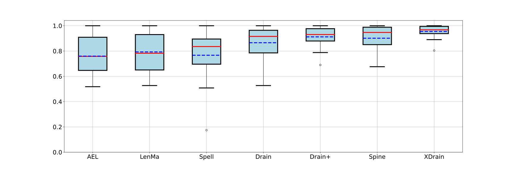

## XDrain
***
### Effective log parsing in log streams using fixed depth forest
***
### ABSTRACT
In real world, performing failure diagnosis in log streams can facilitate the avoidance of losses. Log parsing is a prerequisite for automated log analysis, which transforms semi-structured logs into structured logs. However, we conducted an empirical study on existing online log parser and found that 1) Variable-starting logs can make some log parsers error-prone. 2) The order of logs in a log stream can have a great impact on the effectiveness. Inspired by a state-of-the-art log parser Drain, we propose XDrain to satisfy online log parsing in real world. To address parsing errors caused by inappropriate log order, XDrain sets a small cache window to shuffle the logs a few times and ultimately decides on the final log template through voting. To handle variable-starting logs, XDrain will generate multiple trees for a log where different words are considered as the starting word, and then vote on the final log template. Experimental results show that XDrain outperforms existing log parsers on two widely-used accuracy metric and is immune to inappropriate log order. On average, XDrain only takes about 107.89s to parse per 1 million logs.

### Experimental results

### Reproduction
1.pip install -r requirements.txt

2.Run "XDrain/benchmark/XDrain_benchmark.py" to get the results of XDrain directly.

The existing parser code reproduced in this paper relies on LogPai.

For the parsers compared in our experiment, we reproduce the code in https://github.com/logpai/logparser.
